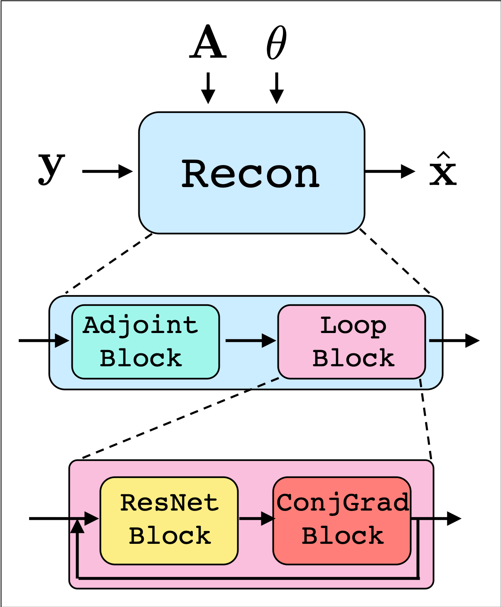
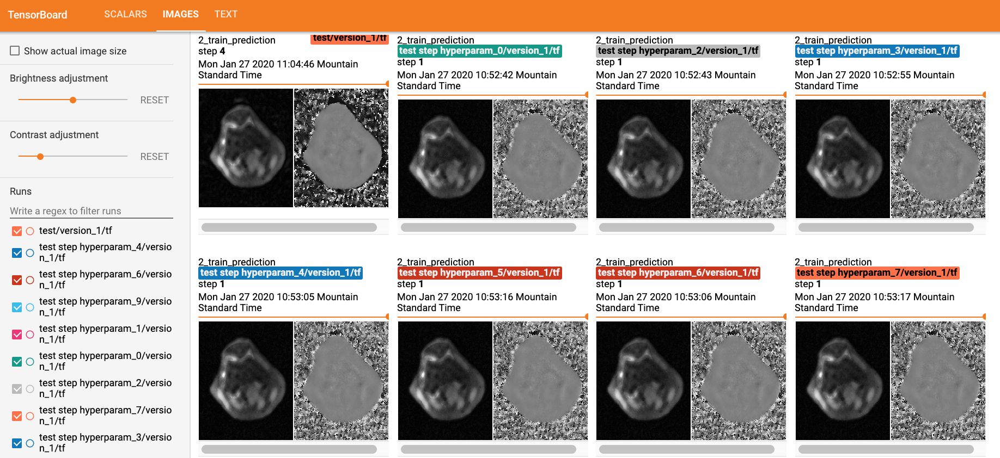

# DeepInPy: Deep Inverse Problems for Python
Work in progress package for training deep inverse problems in python

## Purpose:
The purpose of this project is to simplify applied research for deep inverse problems, with specific focus on magnetic resonance imaging (MRI). Deep inverse problems aim to invert a signal model using a combination of deep learning and iterative algorithms, given a dataset of prior knowledge. 

Many approaches to deep inverse reconstructions follow a similar paradigm:
- Define a signal model, e.g. Multi-channel MRI  
- Define a reconstruction algorithm, consisting of a mix of model-based components and learning-based components  
- Load a dataset for training, typically including ground-truth measurements  
- Train the model using the data  
- Visualize the results  
- Search for model hyperparameters  

To perform this work, a large amount of skeleton code is often necessary, for example to define training loops appropriately. Recently, a number of high-level pacakges aim to streamline this work. In particular, [Pytorch Lightning][pytl] operates as a light layer above PyTorch, enabling researchers to focus on model-building.

This package aims to bring the simplicity of PyTorch Lightning to the inverse problem community by further streamlining the above processes, freeing the user to focus on the innovative components while still easily following best practices for training.


### Functionality
DeepInPy combines [PyTorch][pytorch], [PyTorch Lightning][pytl], and [Test Tube][testtube] to support rapid prototyping of deep inverse problems. Among its features, DeepInPy incorporates the following functionality:
- Modular reconstruction block design,  
- Multi-GPU training across multiple machines,  
- TensorBoard training visualization,  
- Hyperparameter logging and search  


At its core, DeepInPy provides an abstract interface for a Recon object, which transforms a data variable `y` to a reconstruction variable `x` with forward model `A` and reconstruction parameters `θ`

Recon objects are composed of a sequence of modular blocks, including System blocks (e.g. multi-channel MRI), Model blocks (e.g. CNNs), and Optimization blocks (e.g. Conjugate Gradient). Using this interface, new reconstructions can be built that incorporate multiple types of blocks, including data consistency, loops (unrolls), and neural networks.




To help with training and hyperparameter search, DeepInPy visualizes typical training results using TensorBoard.



DeepInPy can leverage packages such as [SigPy][sigpy] and [Torch KB NUFFT][torchkbnufft] to create the (non-Cartesian) forward models and other signal processing functions. 


## Installation

```bash
conda install -c anaconda mkl
conda install -c pytorch pytorch torchvision
pip install -r requirements.txt
```

### Optional dependencies
[SigPy][sigpy]:
```bash
pip install sigpy
```

[Torch KB NUFFT][torchkbnufft]:
```bash
pip install torchkbnufft
```

### Test dataset
https://utexas.box.com/s/f1rpp5wvpzqorthxg98rbpszc5816c2f

[sigpy]: https://github.com/mikgroup/sigpy
[torchkbnufft]: https://github.com/mmuckley/torchkbnufft
[pytl]: https://github.com/PyTorchLightning/pytorch-lightning/
[pytorch]: https://pytorch.org/
[testtube]: https://github.com/williamFalcon/test-tube
